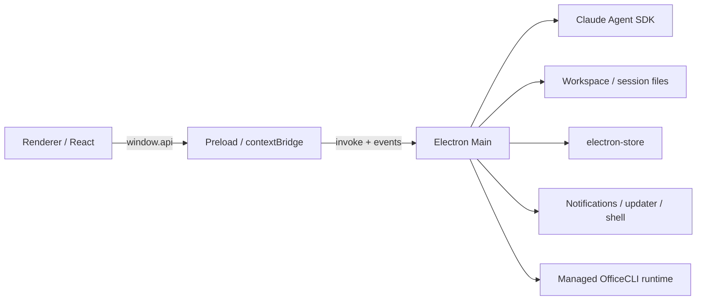

# 当前架构

本文描述当前代码，不是规划稿。模块边界发生变化时应同步更新。

## 进程边界

BrowserWindow 在 `src/main/index.ts` 中创建，启用 sandbox、context isolation 和 web security，关闭 Node integration。主进程是文件系统、SDK、通知、更新与持久化的信任边界。

## Main

### 启动层

`src/main/index.ts` 负责：

- 配置应用身份和 Sentry
- 注册 IPC
- 初始化知识库和文件索引
- 同步内置 Skills
- 恢复持久化 Cron 任务
- 创建窗口并配置外链、更新和退出清理

### IPC 层

`src/main/ipc-handlers.ts` 只负责顶层注册。实际处理器按领域拆在 `src/main/handlers/`：workspace、editor、settings、agent、memory、graph、cron、skills、attachments、office、search 和 connection。

`src/shared/ipc-types.ts` 定义请求、响应和推送事件；`src/preload/index.ts` 将其适配成 `window.api`。新增 IPC 时必须同时维护这两个边界和 renderer 类型。

### Agent 层

- `query-runner.ts`：准备会话目录、构建 prompt/options、执行 `query()`、消费 SDK 流
- `agent-options.ts`：模型 Profile、环境变量白名单、Claude CLI 路径、SDK Options
- `session-runtime.ts`：活跃运行注册、AbortController、权限/AskUser、文本批次、实时生成活动和会话事件
- `pending-interactions.ts`：权限与 AskUser 的注册、超时、SDK 取消、通知清理、响应和按 session 拒绝
- `generation-activity-projector.ts`：将 SDK 内容块和工具输入流投影为会话级生成活动；Renderer 不接触 SDK 原始事件
- `message-converter.ts`：SDK 消息转换为 renderer 使用的消息协议
- `session-store.ts`：SDK 会话列表、历史分页、重命名、删除及 compaction 过滤
- `session-persistence-adapter.ts`：SDK 会话 materialization 与 app session 元数据之间的桥接
- `inline-rewrite-runner.ts`：编辑器选区的临时 AI 改写；打开提示框时预热一次性 SDK 进程，提交后执行低推理强度的单轮纯 Markdown 改写；禁用工具与 transcript 持久化，可按 request ID 取消
- `officecli-runtime.ts`：固定版本 OfficeCLI 的按需下载、SHA-256 校验、原子安装和能力探测；Agent 环境只获得受管二进制路径，并禁用 OfficeCLI 自更新

### 文件与授权

每个 workspace session 使用独立的 `.sumi/sessions/<hash>/` 工作目录。`session-file-access.ts` 根据工作目录、内置 Skill 目录、附件授权和用户显式路径决定工具访问；renderer 提供的路径不能直接作为授权依据。

`session-file-catalog.ts` 从受管会话目录实时发现产物，不维护另一份 artifact 数据库。

`memory-policy.ts` 是 Auto Memory 的策略 Module：交互会话和 Ask 共享应用 user-data 下的全局目录，自动化、行内改写和解析器显式禁用记忆；其系统提示只允许稳定、用户强相关、跨任务有效的信息进入记忆。`memory-files.ts` 管理该目录中的 Markdown 索引与主题文件，并拒绝目录穿越、嵌套文件和符号链接。

### 持久化

共享的 electron-store 实例位于 `persistence/store-core.ts`：

- `profile-store.ts`：Profile、API Key、模型和服务地址
- `workspace-store.ts`：授权目录、workspace、app session 元数据、知识库
- `settings-store.ts`：主题、Cron、Skill 开关和 compaction IDs

Claude SDK JSONL 是对话 transcript 的来源；electron-store 保存产品级映射和展示元数据。两者职责不同。

### 搜索、图谱与 Skills

`file-index-service.ts` 为工作区提供全文搜索，并为知识库维护文件节点与去重后的双向 wikilink 关系图。Renderer 使用 `react-force-graph-2d` 在固定视口中显示图谱。

内置 Skill 由 manifest 驱动并在启动时安装到应用自己的 Claude 配置目录。Workspace 通过轻量链接发现这些 Skills。社区 Skill 通过受控 catalog 安装、更新和卸载。“Office 文档”是默认关闭的内置能力；首次启用时由 main process 准备 OfficeCLI 运行时，Skill 只提供 Agent 工作流和质量检查规则。

## Renderer

Renderer 是单页 React 应用：

- `App.tsx`：主题、设置缓存、更新订阅和全局 provider
- `AppShell.tsx`：Workspace、编辑器、Agent panel、搜索和图谱编排
- `agent-store*`：按 context 与 session 隔离的流式状态
- `session-slot-state.ts`：集中 app/SDK ID 解析、live/cache slot 路由、镜像写入与 LRU 淘汰
- `ui-slice.ts`：非 Agent UI 状态
- `useAgent.ts`：唯一 IPC 订阅入口和 Agent actions
- `notification-inbox.ts`：应用内通知的保留、持久化、toast 计时、已读状态和详情选择
- `automation-task-draft.ts`：自动化草稿状态、频率派生、目标构建、网址规则和任务注册
- `KnowledgePanel.tsx`：知识库一级模块，集中知识统计、刷新/错误恢复和图谱浏览
- `MemorySettingsPage.tsx`：设置中的全局记忆管理页，渲染 Markdown，并提供索引/主题记忆的查看、编辑和删除
- `GraphView.tsx`：知识图谱渲染，仅观察固定 Canvas 宿主尺寸；单击节点负责选中，悬浮胶囊提供显式的文档打开操作；节点坐标在模块生命周期之间缓存，显著尺寸变化后受控适配视口，并通过主题 token 绘制 Canvas
- `MarkdownEditor.tsx`：Tiptap Markdown 编辑、自动保存及选区级 AI 改写审阅
- `AssistantMarkdown.tsx`：Streamdown + Shiki + KaTeX + Mermaid

React 组件错误由 ErrorBoundary 隔离；全局同步错误和未处理 Promise 使用可关闭 banner，不创建阻断式全屏遮罩。

行内 AI 改写通过 ProseMirror decoration 显示原文删除线和 Markdown 建议，只有 Accept 才产生文档 transaction 并进入自动保存；Undo/取消不会修改文件。

## 打包

Renderer 依赖由 Vite 打入静态资源；只有 main/preload 运行时依赖保留在生产 `node_modules`。Claude 原生二进制及 CLI 相关文件通过 `asarUnpack` 放入 `app.asar.unpacked`。Skills 作为 `extraResources` 打包；pack/dist 后同时校验 Skill 完整性和 `app.asar` 顶层运行时 allowlist。

当前 macOS 构建目标为 arm64 DMG/ZIP。Tag Release 通过 GitHub Actions 导入 Developer ID 证书，并使用 electron-builder 内置流程执行 hardened runtime、签名和 notarization；本地没有发布凭据时生成未签名验证包。
