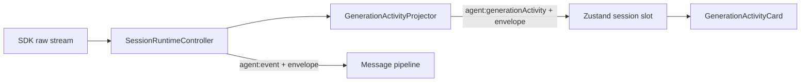

# 内置 Skill 架构

本文说明 sumi 自带 Skill 的注册、安装、发现和输出链路。各 Skill 自身的 `SKILL.md` 属于运行时资源，不是项目架构文档。

## 权威来源

- `skills-manifest.json`：打包资源、必需路径、版本和可追溯上游信息
- `skills-manifest.ts`：manifest 的类型适配
- `builtin.ts`：UI 展示和调用元数据
- `<skill-id>/`：实际运行时文件

一个内置 Skill 必须同时出现在 manifest 和 `builtin.ts`，且资源目录至少包含 `SKILL.md`。

## 新增流程

1. 将真正运行所需的文件放入 `src/main/skills/<skill-id>/`。保留 Skill 引用的相对路径；不要复制 `.git`、演示站点、发布压缩包等无关内容。
2. 在 `skills-manifest.json` 中登记 `id`、`requiredPaths`，有可靠来源时再填写版本、固定 commit 和许可证。
3. 在 `builtin.ts` 中添加名称、说明、图标、prompt template 和可选 `outputMode`。
4. 运行 `npm test`、`npm run build` 和 `npm run pack`。Pack 会比较源码与 `.app` 中的每个 Skill 文件。

Manifest 示例：

```json
{
  "id": "example-skill",
  "hasResources": true,
  "requiredPaths": ["SKILL.md", "scripts/run.sh"],
  "source": {
    "repositoryUrl": "https://github.com/owner/repo",
    "ref": "40-character-commit",
    "license": "MIT"
  }
}
```

UI 定义示例：

```ts
{
  id: 'example-skill',
  name: 'Example',
  description: '...',
  icon: 'FileText',
  promptTemplate: '使用 example-skill skill 处理 {activeFile}',
  outputMode: 'write',
}
```

`outputMode: 'write'` 表示主要产物来自会话目录中的文件；`skill-output` 表示 Skill 通过专用围栏输出实时预览。省略时使用普通对话展示。

需要额外下载运行组件的能力应设置 `defaultEnabled: false`。启用操作必须先由 main process 完成受管运行时准备，不能让 Skill 自行运行全局安装器。`office-documents` 使用这一模式：OfficeCLI 固定版本、发布资产哈希和原子安装由 `officecli-runtime.ts` 管理，Skill 只描述调用流程。

## 安装与发现

应用启动时，`skill-init.ts` 选择 Skill 源目录：

- 开发：`src/main/skills/`
- 打包：`resources/skills/`

`builtin-skill-installer.ts` 对每个 Skill 计算完整文件清单和内容哈希，然后以 staging/backup 目录原子替换到：

```text
<app-user-data>/.claude/skills/<skill-id>/
```

安装状态保存在同目录的 `.sumi-builtin-skills.json`。Manifest 移除的内置 Skill 会在下次同步时删除。

Workspace 不复制完整资源；`workspace-skill-links.ts` 在会话工作目录中创建指向全局安装的轻量链接。`query-runner.ts` 将用户启用的 Skill IDs 传给 SDK，并使用 project setting source 发现它们。

## 社区 Skills

社区 Skill 不进入内置 manifest。`community-catalog.ts` 提供受控目录，`community-skill-installer.ts` 负责 staging、校验、安装、更新和卸载；`handlers/skill-handlers.ts` 暴露 renderer API。

社区与内置 Skill 最终共享同一个 app-owned Skill 根目录，但安装记录和升级来源不同。

## 实时输出



`GenerationActivityProjector` 按 app session key 保存独立投影状态：

- `processRawMessage(queryKey, rawMessage, activeSkillId)` 在消息转换前接收 SDK 原始事件
- 工具开始时立即产生 preparing 活动，不等待正文出现
- 按 SDK content block index 隔离并行工具输入，捕获 `skill-output` 围栏和可预览的 Write/Edit 输入
- Bash 等没有正文的工具仍提供活动反馈，但不把命令文本伪装成产物内容
- 将结果规范化为带 `AgentSessionEnvelope` 的 `SessionRoutedGenerationActivity`
- `reset`、`setSessionEnvelope`、terminal phase 和 `cleanup` 均以 query key 为作用域

Renderer 通过 `window.api.agent.onGenerationActivity` 接收事件，`useAgent.ts` 把它路由到对应 session slot。Renderer 只消费 preparing/generating/finalizing 等产品状态，不解析 `input_json_delta`、工具名或部分 JSON；终态会移除临时卡片。正式产物仍由 `session-file-catalog.ts` 扫描会话工作目录提供。

## 打包保证

`electron-builder.yml` 将 `src/main/skills` 作为 `extraResources` 放入应用。`scripts/verify-packaged-skills.mjs` 在 `pack`、`dist` 和 `release` 后逐文件比较大小和 SHA-256，并检查 manifest 的 `requiredPaths`。

不要通过扩大 `files` 中的 Node 依赖来打包 Skill；Skill 资源和应用 JavaScript 依赖是两条独立链路。
