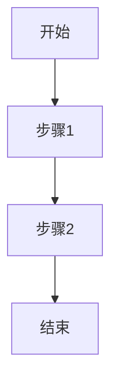

# PRD Generator

Generate structured Product Requirement Documents. Follow the five-part template and three-stage iteration process.

## Core Rule

**Think clearly before writing.** Ask clarifying questions when the user's input is vague. Every ambiguity in the PRD causes AI downstream to guess — and guessing produces bugs.

## Workflow

### Stage 0 — Clarify (always ask if unclear)

Before generating, confirm with the user:

1. **Who is the user?** (角色)
2. **What is the core problem?** (核心痛点)
3. **Why this solution?** (为什么用户会选择它)
4. **What is the MVP scope?** (最小可行范围)

If the user hasn't answered all four, ask. Don't guess.

### Stage 1 — 初稿 (Why)

Focus exclusively on background and goals:

- Document info (version, stage, stakeholders)
- Background & core problem
- User stories in format: `作为<角色>，我想要<任务>，以便于<价值>`
- Project objectives (SMART principle)
- In-scope / out-of-scope table

Output as Markdown. After output, ask: "这是初稿，确认方向后我补充交互流程和原型描述。"

### Stage 2 — 中稿 (What)

Add solution design:

- Core business flow (Mermaid diagram)
- Functional flowcharts
- Page/interaction prototypes (text descriptions)
- Edge case handling

### Stage 3 — 定稿 (How)

Finalize with:

- UI design details
- Non-functional requirements
- Analytics tracking plan
- Launch plan & rollout strategy

## PRD Template

All PRDs use this five-part structure:

### 一、文档信息

| 字段 | 内容 |
|------|------|
| 文档版本 | v0.1 |
| 当前阶段 | 初稿 / 中稿 / 定稿 |
| 创建日期 | YYYY-MM-DD |
| 负责人 | — |
| 评审人 | — |
| 迭代记录 | v0.1 初始版本 |

### 二、背景与目标

- **项目背景**: 一句话概述
- **核心问题**: 要解决什么问题
- **用户故事**:
  - 作为<角色>，我想要<任务>，以便于<价值>
- **项目目标** (SMART): Specific, Measurable, Achievable, Relevant, Time-bound
- **范围定义**:

| 类别 | 内容 |
|------|------|
| 本期范围 | — |
| 明确不做 | — |
| 后续迭代 | — |

### 三、方案概述

- **核心业务流程** (Mermaid diagram):

- **功能模块划分**
- **信息架构**

### 四、详细方案

- **页面原型描述**: 每个页面的布局、元素、交互说明
- **交互流程**: 关键操作的点击路径
- **边界场景处理**:
  - 空状态
  - 错误状态
  - 加载状态
  - 极端数据
- **非功能需求**: 性能、安全、兼容性

### 五、上线计划

- **里程碑时间线**
- **灰度策略**
- **监控指标**
- **回滚方案**

## User Story Format

Always use: `作为<角色>，我想要<完成任务>，以便于<实现价值>`

Example: 作为内容创作者，我想要一键排版我的文章，以便于快速生成专业美观的 PDF 文档。

## After Every Interaction

After any requirements discussion output, restate:
- Who the target user is
- What the core features are
- What is explicitly out of scope
- Any potential issues or risks identified
